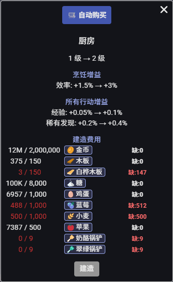
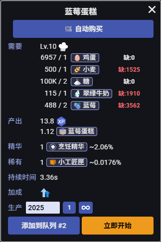

* * *

# 📜 Plugin Usage Disclaimer / 插件使用说明

觉得手动计算和购买各种材料很麻烦？  
试试这个脚本吧！

✨ ​**​精准计算​**​：  
自动扫描并列出你当前缺少的所有材料数量。告别手动清点库存的日子！

🛒 ​**​一键补货​**​：  
检测到缺口后，只需点击一次按钮，脚本会自动从商店购买全部所需材料。再也不用反复进出商店、逐个查找补货了！

* * *

|     |     |
|:---:|:---:|
|  |  |

## About Script Behavior in This Plugin:

### Game Rules

#### 4. **Bots, Scripts, and Extensions**

**4.1 No Botting:** Do not use any automation that plays the game for you.

**4.2 Scripts and Extensions:** Any scripts or extensions **must not take any actions for the player** (send any requests to server). You are allowed to use them *purely for information display purposes or UI improvements* (ex: Display combat summary, track drops, move buttons to different location)

---

## 关于使用本插件可能存在的脚本行为说明：

### 《游戏规则》

#### 4. 机器人、脚本和扩展

**4.1 禁止机器人：** 请勿使用任何自动化程序代替你操作游戏。

**4.2 脚本和扩展：** 任何脚本或扩展程序**不得为玩家执行任何操作**（如向服务器发送请求），*仅限用于显示信息或改进用户界面*（例如：显示战斗摘要、跟踪掉落、将按钮移动到不同位置）。

---

## ⚠️ Important Notice / 重要提醒

**Please read the game rules carefully before choosing to install and use this plugin. Thank you!**

**请在仔细阅读游戏规则条款后，再选择是否安装使用本插件，谢谢！**

### 🔧 Installation / 安装说明

1. Install **Tampermonkey** or similar userscript manager
2. Click the **install button** on this page
3. Enjoy the enhanced UI!

1. 安装 **Tampermonkey** 或类似的用户脚本管理器
2. 点击本页面的**安装按钮**
3. 享受增强的用户界面！

---

*This script is intended to simplify operational procedures through an enhanced user interface. No warranty of complete safety is provided by the author. The user assumes any and all risks, liabilities, and responsibilities arising from its use.​*

*本脚本旨在通过增强的用户界面简化操作流程。作者不提供任何形式的完全安全担保。使用者需自行承担由此产生的一切风险与责任。*