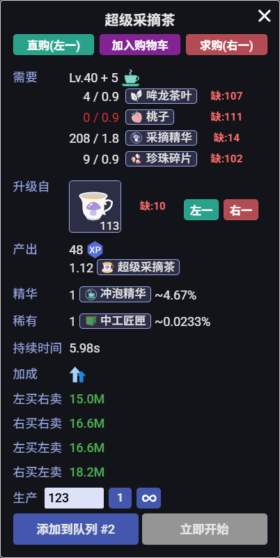
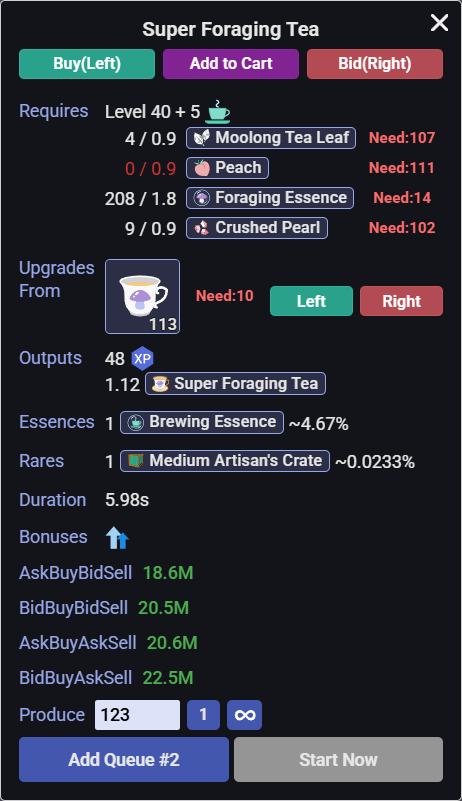
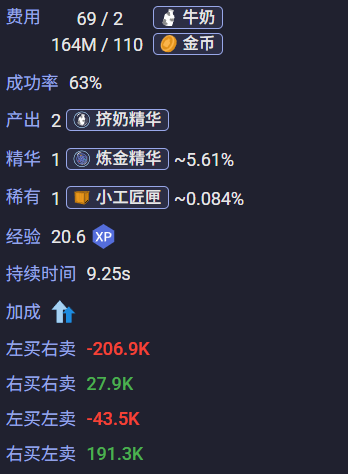
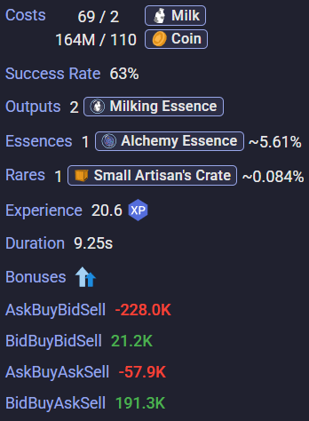
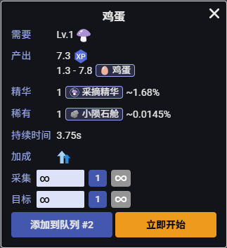
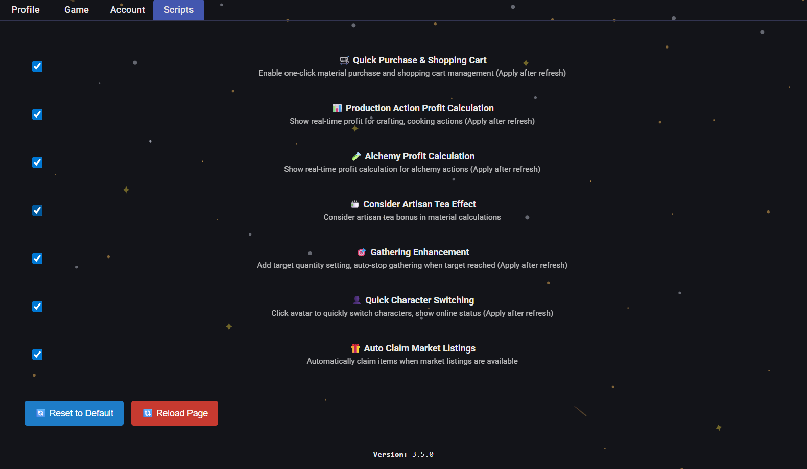
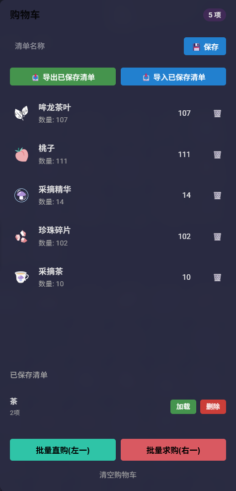
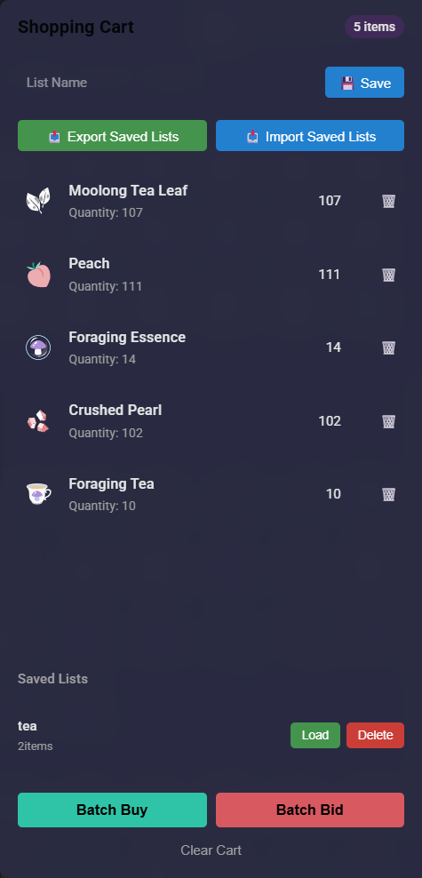
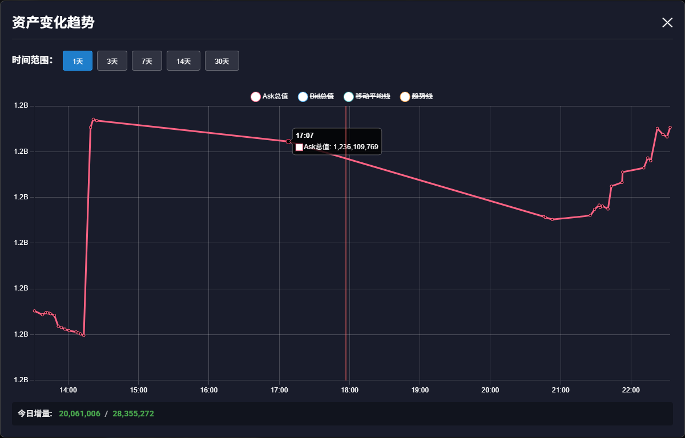
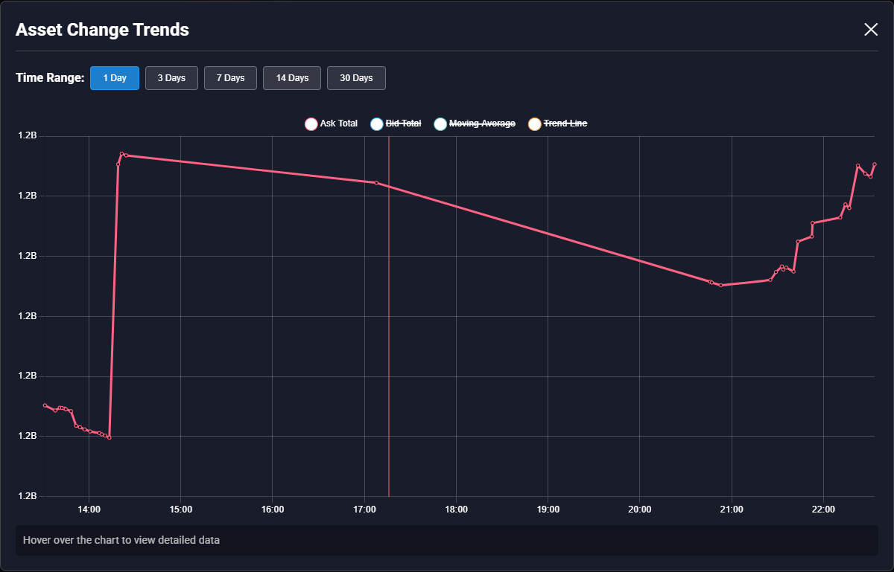

#  [银河奶牛] 生产采集增强 / MWI Production & Gathering Enhanced

计算生产、强化、房屋所需材料并一键购买；显示今日资产增量，统计30天总资产生成走势图；计算生产与炼金实时利润；按照目标材料数量进行采集；快速切换角色；自动收集市场订单；功能支持自定义开关。

*Calculates the materials required for production, enhancement, and housing, and allows one-click purchasing; displays today's asset growth and generates a 30-day total asset trend chart; calculates real-time profit for production and alchemy; gathers resources based on target material quantities; supports quick character switching; automatically collects market orders; all features support customizable toggles.*

---

## ✨ 主要功能 / Key Features 
 
### 🧮 材料自动计算 / Auto Material Calculation 
- **自动计算**：自动计算并列出你当前缺少的所有材料数量 
- **多种场景**：支持生产、强化、房屋等材料计算 
 
*Automatically calculates and lists all missing materials with real-time updates for crafting, cooking, enhancing, and housing scenarios.* 
 
### 🛒 一键购买 / One-Click Purchase 
- **左一购买**：直接从市场购买 
- **右一求购**：按最高求购出价提交求购订单 
- **批量处理**：自动处理多种材料的购买流程 
- **购物车**：加入购物车，保存购物清单，导入导出购物清单 
 
*Supports instant purchase at lowest ask price and bid orders at highest bid price with batch processing. Includes shopping cart with save/load/import/export functionality.* 
 
### 📊 炼金 & 生产利润分析 / Alchemy & Production Profit Analysis 
- **实时计算**：根据当前市场价格实时计算炼金收益 
- **四重模式**：左买右卖，左买左卖，右买右卖，右买左卖 
- **全面考虑**：纳入buff效果、饮料加成、装备属性、催化剂效果等 
 
*Real-time profit calculation for alchemy and production with 4 pricing modes (ask-buy-bid-sell, ask-buy-ask-sell, bid-buy-bid-sell, bid-buy-ask-sell), considering all buffs, consumables, equipment bonuses, and catalyst effects.* 
 
### 🎯 采集增强 / Gathering Enhanced 
- **按目标数量采集**：完成设定目标数量后自动停止 
 
*Set target quantities for gathering actions with automatic stop when the specified amount is reached.* 
 
### 🔄 快速角色切换 / Fast Character Switching 
- **一键切换**：点击头像即可快速切换角色 
 
*Click avatar to quickly switch between characters with online status display, smart caching, and clear game mode indicators.* 

### 🎁 自动收集市场订单 / Auto Claim Market Listings
- **自动收集**：当有市场订单可收集时自动收集物品或金币

*Automatically claims items or coins when market listings are available for collection.*

### 💰 总资产统计 / Daily Asset Tracking
- **每日增量**：在背包界面显示每日资产增量
- **趋势图表**：点击查看30天资产变化趋势图表

*Displays daily asset increment in inventory interface with clickable trend chart showing 30-day asset change analysis.*

---

## 🔧 安装说明 / Installation

### 安装地址:[https://greasyfork.org/zh-CN/scripts/538797](https://greasyfork.org/zh-CN/scripts/538797)

1. 安装 **Tampermonkey** 或类似的用户脚本管理器
2. 安装此脚本
###
1. Install **Tampermonkey** or similar userscript manager
2. Install this script

---

## 📸 使用截图 / Screenshots

| 中文界面 / Chinese UI | 英文界面 / English UI |
|---------|---------|
|  |  |
|  |  |
|  |  |
|  |  |
|  |  |
|  |  |
|  |  |

---

## 关于使用本插件可能存在的脚本行为说明：

### 《游戏规则》

#### 4. 机器人、脚本和扩展

**4.1 禁止机器人：** 请勿使用任何自动化程序代替你操作游戏。

**4.2 脚本和扩展：** 任何脚本或扩展程序**不得为玩家执行任何操作**（如向服务器发送请求），*仅限用于显示信息或改进用户界面*（例如：显示战斗摘要、跟踪掉落、将按钮移动到不同位置）。

---

## About Script Behavior in This Plugin:

### Game Rules

#### 4. **Bots, Scripts, and Extensions**

**4.1 No Botting:** Do not use any automation that plays the game for you.

**4.2 Scripts and Extensions:** Any scripts or extensions **must not take any actions for the player** (send any requests to server). You are allowed to use them *purely for information display purposes or UI improvements* (ex: Display combat summary, track drops, move buttons to different location)

---

## 🔄 更新日志 / Changelog

最近版本：**v3.6.1**（2025-07-21）  
- 🔧 修复总资产计算缺失数据的bug，增加健壮性

**👉 [查看完整更新日志](./CHANGELOG.md)**

---

## 🤝 贡献与反馈 / Contribution & Feedback

如果您在使用过程中遇到问题或有改进建议，欢迎反馈！

*If you encounter any issues or have suggestions for improvements, feedback is welcome!*

---

*本脚本旨在通过增强的用户界面简化操作流程。作者不提供任何形式的完全安全担保。使用者需自行承担由此产生的一切风险与责任。*

*This script is intended to simplify operational procedures through an enhanced user interface. No warranty of complete safety is provided by the author. The user assumes any and all risks, liabilities, and responsibilities arising from its use.​*
