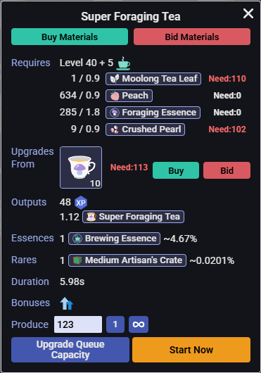
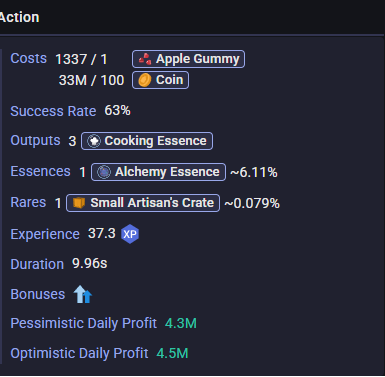
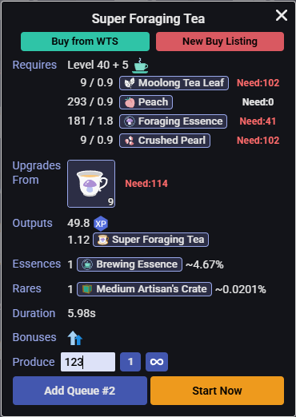
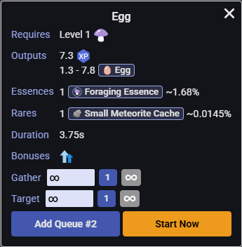

#  [银河奶牛] 生产采集增强 / MWI Production & Gathering Enhanced

计算制造、烹饪、强化、房屋所需材料并一键购买，计算实时炼金利润，增加按照目标材料数量进行采集的功能，快速切换角色。

*Calculate materials for crafting, cooking, enhancing, housing with one-click purchase, calculate real-time alchemy profits, add target-based gathering functionality, fast character switching.*

---

## ✨ 主要功能 / Key Features

### 🧮 材料自动计算 / Auto Material Calculation
- **自动计算**：自动计算并列出你当前缺少的所有材料数量
- **多种场景**：支持制造、烹饪、强化、房屋等材料计算

*Precisely calculates and lists all missing materials with real-time updates for crafting, cooking, enhancing, and housing.*

### 🛒 一键购买 / One-Click Purchase
- **左一购买**：直接从市场购买
- **右一求购**：按最高求购出价提交求购订单
- **批量处理**：自动处理多种材料的购买流程

*Supports both instant purchase at lowest ask price and bid orders at highest bid price with batch processing.*

### 📊 炼金利润分析 / Alchemy Profit Analysis
- **实时计算**：根据当前市场价格实时计算炼金收益
- **双重模式**：
  - **悲观日利润**：基于左买右卖的保守估算
  - **乐观日利润**：基于右买左卖的激进估算
- **全面考虑**：纳入buff效果、饮料加成、装备属性、催化剂效果等

*Real-time alchemy profit calculation with pessimistic and optimistic modes, considering all buffs, consumables, equipment, and catalyst effects.*

### 🎯 采集增强 / Gathering Enhanced
- **按目标数量采集**：完成设定目标数量后自动停止

*Set target quantities for gathering actions with automatic stop when reached.*

### 🔄 快速角色切换 / Fast Character Switching
- **一键切换**：点击头像即可快速切换角色

*Click avatar to quickly switch between characters with bilingual support, smart caching, and clear game mode indicators.*

---

## 🔧 安装说明 / Installation

### 安装地址:[https://greasyfork.org/zh-CN/scripts/538797](https://greasyfork.org/zh-CN/scripts/538797)

1. 安装 **Tampermonkey** 或类似的用户脚本管理器
2. 安装此脚本
###
1. Install **Tampermonkey** or similar userscript manager
2. Install this script

---

## 📸 使用截图 / Screenshots

| 中文界面 / Chinese UI | 英文界面 / English UI |
|---------|---------|
|  |  |
|  |  |
|  |  |

---

## 关于使用本插件可能存在的脚本行为说明：

### 《游戏规则》

#### 4. 机器人、脚本和扩展

**4.1 禁止机器人：** 请勿使用任何自动化程序代替你操作游戏。

**4.2 脚本和扩展：** 任何脚本或扩展程序**不得为玩家执行任何操作**（如向服务器发送请求），*仅限用于显示信息或改进用户界面*（例如：显示战斗摘要、跟踪掉落、将按钮移动到不同位置）。

---

## About Script Behavior in This Plugin:

### Game Rules

#### 4. **Bots, Scripts, and Extensions**

**4.1 No Botting:** Do not use any automation that plays the game for you.

**4.2 Scripts and Extensions:** Any scripts or extensions **must not take any actions for the player** (send any requests to server). You are allowed to use them *purely for information display purposes or UI improvements* (ex: Display combat summary, track drops, move buttons to different location)

---

## 🔄 更新日志 / Changelog

### v3.2.0
- 增加购物车功能

### v3.1.6
- 优化快速切换角色功能

### v3.1.5
- 修复了大陆欧洲系统计数方式不同导致数量计算错误的bug，现在1.234,56和1,234.56都会被正确当作1234.56处理

### v3.1.4
- 修复手机端库存数量获取错误的bug

### v3.1.3
- 修复了一个会导致脚本无法正常加载的bug

### v3.1.2
- 优化性能

### v3.1.1
- 增加上次在线时间显示
  
### v3.1.0
- 新增快速角色切换功能

### v3.0.1
- 修改错别字...

### v3.0.0
- 将自动计算购买材料和炼金利润计算器合并
- 新增按目标数量采集的功能

---

## 🤝 贡献与反馈 / Contribution & Feedback

如果您在使用过程中遇到问题或有改进建议，欢迎反馈！

*If you encounter any issues or have suggestions for improvements, feedback is welcome!*

---

*本脚本旨在通过增强的用户界面简化操作流程。作者不提供任何形式的完全安全担保。使用者需自行承担由此产生的一切风险与责任。*

*This script is intended to simplify operational procedures through an enhanced user interface. No warranty of complete safety is provided by the author. The user assumes any and all risks, liabilities, and responsibilities arising from its use.​*
